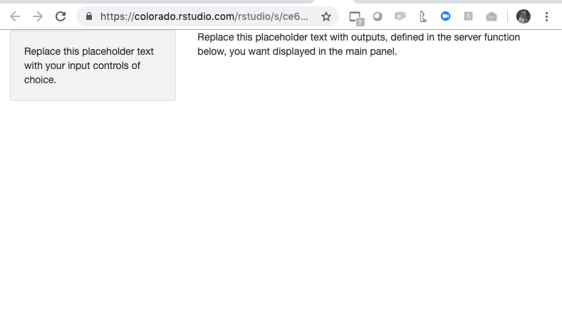
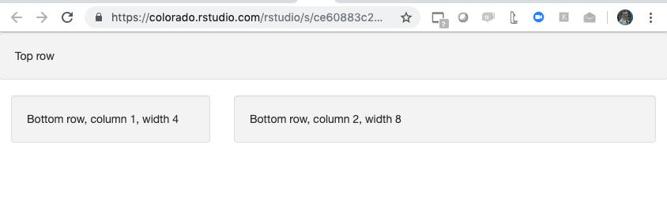
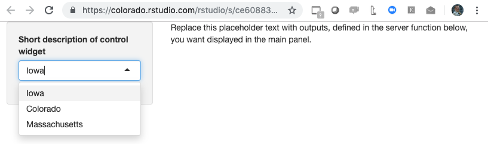

# User Interface 

How your application will look will be determined by the `ui` object you define. This is where you will choose the layout of your application, the input controls available to the user, and the content that will be made visible. Let's start with choosing a layout:

## Layout Options 

At the time of this writing, you should always start with the `fluidPage` function as the outermost layer of your ui. This is the function you will use to pass important elements of your UI, such which layout type you'd like to use.

**Sidebar Layout** 

One of the most commmon application layouts is theSidebar Layout, which has a skinny sidebar on the left hand-side (by default) where input controls are usually added and a main panel on the right-hand side which typically displays the results. To create this type of layout, simply pass the shiny ui function `sidebarLayout` to `fluidPage`. The `sidebarLayout` functions contains 2 required arguments, `sidebarPanel` and `mainPanel`, which are functions you can use to define the input controls for the sidebar and the output content you went to display in the main panel, respectively:

```{r, eval=FALSE}
# Minimum viable example of a shiny app with a sidebar layout

library(shiny)

# Define UI
ui <- fluidPage(
    # Sidebar Layout
    sidebarLayout(
        # Sidebar Layout Elements
        sidebarPanel = sidebarPanel("Replace this placeholder text with your input controls of choice."),
        mainPanel = mainPanel(
            "Replace this placeholder text with outputs, defined in the server function below,
                                        you want displayed in the main panel."
        )
        
    ))


# Server function
server <- function(input, output) {
    
}

# Run the application
shinyApp(ui = ui, server = server)


```

This code generates the very boring looking application below. As you can see, it is made up of a small sidebar on the left and a main panel on the right:



**Grid Layout** 

This type of layout gives you a bit more control of how to arrange your page. First, use the function `fluidRow` to add  rows to your application and then the function `column` to create columns within those rows. These function allow you to create any grid layout you like, including even grids within grids. To create a page with 2 rows, 1 colum for the top half, and 2 columns for the bottom half, I would write the following code:

```{r, eval = FALSE}
# Minimum viable example of a shiny app with a grid layout

library(shiny)

# Define UI
ui <- fluidPage(
  # Grid Layout
    fluidRow(wellPanel("Top row")),
    fluidRow(column(width = 4, wellPanel("Bottom row, column 1, width 4")),
             column(width = 8, wellPanel("Bottom row, column 2, width 8"))))


# Server function
server <- function(input, output) {
    
}

# Run the application
shinyApp(ui = ui, server = server)

```

Running the code generates the following shiny application:



The first argument of the `column` function is width, which is  based on the Bootstrap 12-wide grid system, so the total width for each row should add up to 12. We also used the function `wellPanel` to give our grid elements a grey background and a slightly inset border. This also gave us the ability to add text. Shiny has numerous "[Panel](https://bookdown.org/weicheng/shinyTutorial/ui.html#layout){target=\"_blank\"}" functions, which you can think as the elements you put inside the layout containers you created using the "Layout" functions like `sidebarLayout`, `fluidrow`, `column`, etc. 

## Input Controls 

An important part of creating the UI for you application is deciding what [input controls](https://shiny.rstudio.com/tutorial/written-tutorial/lesson3/), also referred to as *control widgets*, the users will have to interact with the application. Whatever value the application user chooses will be saved to a variable called `input` which you will use in the server section of your application.

There are 13 standard control widgets from simple check boxes to sliders. To add a control widget to you shiny application, add the control widget function of your choice inside one of the \*Panel functions. All widget control functions take at least 2 arguments: the **inputID** argument, which you will need to access the user input value in your code, and the **label** argument, where you can enter the description of the control widget visible to the user.

With applications using a sidebar layout style, it is common to add widget controls in the `sidePanel` function, since it is better to reserver the bigger `mainPanel` for displaying plots. Below is an example of how you would add a searchable dropdown box to your shiny application using the widget control function `selectInput`:

```{r, eval = FALSE}
# Example of a shiny application with a sidebar layout and a selectInput control widget
library(shiny)

# Define UI
ui <- fluidPage(
  # Sidebar Layout
  sidebarLayout(
    # Sidebar Layout Elements (i.e. the panels)
    sidebarPanel = sidebarPanel(
      #Control Widget
      selectInput(
        inputId = "input_1",
        label = "Short description of control widget",
        choices = c(
          "Iowa" = "IA",
          "Colorado" = "CO",
          "Massachusetts" = "MA"
        )
      )
    ),
    mainPanel = mainPanel(
      "Replace this placeholder text with outputs,
      defined in the server function below,
      you want displayed in the main panel."
    )
    
  ))

# Server function
server <- function(input, output) {
  
}

# Run the application
shinyApp(ui = ui, server = server)

```



Make a mental note of the `inputID` you choose for each of your control widgets, because this is how you will access the user input values in the server section of your application.

## Customizing your UI 

It is possible to customize the UI of your Shiny application by writing your own HTML code. This is not required, and most people who use Shiny will not write the HTML themselves but will rather use R functions that will create the HTML UI page for them, as we described in the previous sections. However, some Shiny developers may know HTML or work with a team that does, and may want to customize their UI. The ability to write your own HTML code allows you to create a more personalized web application.

There are 3 options for writing your UI's HTML: 

1. Use R functions to write custom HTML code: R functions like `tags` can be added to your UI and like all other R shiny functions will get translated into HTML.
2. Write the whole UI as an HTML document (index.html)
3. Use HTML to write your HTML components, and R to write your Shiny components, using the `htmlTemplate` function

To learn more about how to customize your Shiny app's UI, watch Garrett Grolemund's video [How to Use HTML to make an awesome web app](https://www.rstudio.com/resources/videos/shiny-ui/).
