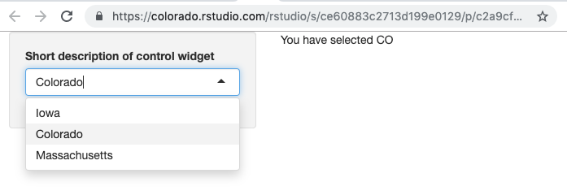

# Server Function 

The server function, the 2nd part of your Shiny application after the UI, is where most of your computation takes place. It is in the server function where you will use the values users inputted via the control widgets to do things like wrangle your data and create outputs like plots. These outputs will be saved to a special object called `output` which you can later reference in your UI in order to display them in your Shiny application.

In the example below, we created a text output using the `textRender` function, saved it to the object `output`, and then displayed that output in our UI's main panel using the function `textOutput`:

```{r, eval=FALSE}
# Example of a shiny application with a sidebar layout, selectInput control widget,
# and simple text output.

library(shiny)

# Define UI
ui <- fluidPage(
    # Sidebar Layout
    sidebarLayout(
        # Sidebar Layout Elements (i.e. the panels)
        sidebarPanel = sidebarPanel(
            #Control Widget
            selectInput(
                inputId = "input_1",
                label = "Short description of control widget",
                choices = c(
                    "Iowa" = "IA",
                    "Colorado" = "CO",
                    "Massachusetts" = "MA"
                )
            )
        ),
        mainPanel = mainPanel(textOutput("output_1"))
    ))

# Server function
server <- function(input, output) {
    output$output_1 <- renderText({
        paste("You have selected", input$input_1)
    })
}
    
# Run the application
shinyApp(ui = ui, server = server)
```



It is useful to remember the following 4 things when creating a new application output:

1. In the server function, access user input values via the variable `input$inputID` 
2. In the server function, build your output (e.g. plot, table, text, etc.) using one of the `render` functions (i.e. `renderPlot`, `renderDataTable`, `renderText`, etc.), choosing the function that matches your output type. Make sure to assign that output to the `output` object.
3. In the UI section, access your output via the variable `output$output_name` 
4. In the UI section, display your output using one of the corresponding \*Output functions based on your output's type (i.e. `plotOutput`, `tableOutput`, `textOutput`, etc.)
