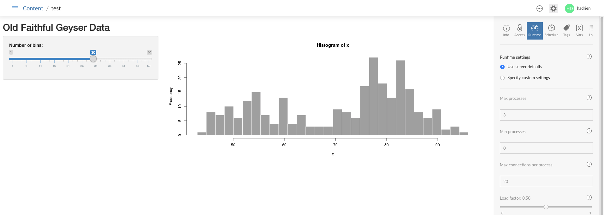

# Optimizing Your Application 

The goal is to have a Shiny application that loads quickly, is responsive, and that can support whatever traffic is thrown at it without crashing. To achieve this, there are many available tools at your disposal. These include writing efficient code, pre-processing data ahead of time, and your infrastructure.

Small edit

## RStudio Connect Infrastructure 

In this section, we'll look at some of the ways you can customize your infrastructure to improve the performance of your applications. 

### Runtime Settings

As the publisher or collaborator of a Shiny application published on RStudio Connect, you have the ability to fine tune how your RStudio Connect server, or servers, should serve your application. These options can be set by editing the "[Runtime](https://docs.rstudio.com/connect/user/settings-panel.html#content-runtime)" options found in the settings pane:



It is useful to adopt a scientific mindset when tuning your server by making changes to your runtime settings and then use tools like [shinyloadtest](https://github.com/sol-eng/plumber-model) to measure how well your application actually performed, keeping the runtime setting configuration which resulted in the best performanace. There are, however, some rules of thumb that you can follow:

**Slow to load, fast after loading**

One common reason an application will load slowly is if it runs on a large data set. In this case, pick a `loadFactor` closer to 1. This will create new R processes less aggressively, meaning there will be more users connected to and sharing the same R process powering your shiny application. This way, your large data set will be loaded fewer times and will be shared by more users. This will also help preserve more of your RStudio Connect server's memory. The advantage will be faster loading times, however the drawback will be that you all the user connections will be powered by a single R process which may slow down response time. This is why a high `loadFactor` works best when the application is slow to load, but is fast otherwise.

In addition to the `loadFactor` setting, you can also explicitly set a limit on the maximum number of connections each R process can support with the `maxRequestsPerProc` variable. Pick a larger number if your application takes a long time to load, but after loading is very responsive to user selections.


**Fast to load, slow after the loading** 

This is the exact opposite of the example above, hence you should pick a small `loadFactor` number. Since your application loads quickly but involves expensive computation, it is better to have fewer connections to each R process by spawing additional R processes more aggressively. Although each R process will have to load data in memory, which takes time and hogs server resources, your users will benefit from faster response time thanks to having to share the same R process with fewer users. 

For these reasons, also pick a small `maxRequestsPerProc` number.

## Profiling Your R Code 

Specific tools have been created to help write faster R code. These include `Rprof` from base R and the `profvis` package which can help you identify the slowest parts of your shiny application and focus on making those faster.

For example, you can profile your app's startup like this:

```{r, eval = FALSE}
library(profvis)
profvis(runApp())
```

Profvis will generate a report made up of 2 graphs. The first will show you how much memory and time each line of code consumers and takes to execute, respectively. It will also generate a flame graph, which is visual representation of the profiler's results.

To learn more about the `profvis` package, check out [rstudio.github.io/profvis](https://rstudio.github.io/profvis/) and this [webinar](https://www.rstudio.com/resources/webinars/profvis-profiling-tools-for-faster-r-code/). 


